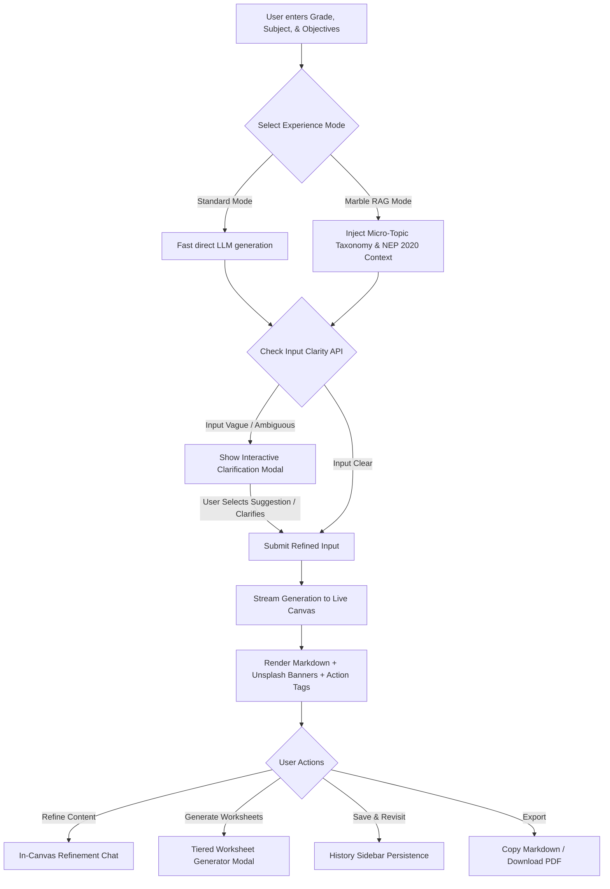

# Product Requirement Document (PRD) — AI Lesson Planner

> **Document Status**: Approved  
> **Target Audience**: Product Managers, AI Engineers, UI/UX Designers, Developers  
> **Project Codebase**: Next.js (App Router), TypeScript, React 19, OpenRouter AI, RAG Taxonomy, SQLite/JSON Storage  

---

## 1. Executive Summary & Vision

### 1.1 Overview
The **AI Lesson Planner** is an intelligent, high-efficiency curriculum generation platform designed to streamline lesson preparation for educators and parents. By combining direct LLM synthesis with a rich **Marble Pedagogical Taxonomy RAG** (Retrieval-Augmented Generation) engine and national curriculum guidelines (such as NEP 2020), the application produces classroom-ready, multi-deliverable educational packs in seconds.

### 1.2 Product Vision
To empower educators and parents with instant, differentiated, and standard-aligned lesson plans, interactive student worksheets, quiz packs, and slide outlines—eliminating hours of manual prep work while elevating pedagogical quality.

---

## 2. Target User Personas

| Persona Attribute | Persona 1: K-12 School Educator | Persona 2: Self-Motivated Parent |
| :--- | :--- | :--- |
| **User Role** | Middle / High School Subject Teacher | Homeschooling Parent / Supportive Tutor |
| **Primary Need** | Standard-aligned, structured lesson plans with clear learning outcomes, rubrics, and PPT outlines. | Engaging, practical hands-on activities, step-by-step guidance, and ready-to-print worksheets. |
| **Pain Points** | Spending 10+ hours/week formatting plans; catering to mixed-ability classrooms without automated tiering. | Unsure how to break down complex topics or check if the child has prerequisite knowledge. |
| **Key Deliverables Used** | Lesson Plan, PPT Presentation Outline, Differentiated Quizzes. | Hands-On Activity Guide, Tiered Worksheets (Beginner / Intermediate / Advanced). |
| **Technical Comfort** | Moderate (prefers simple forms, quick copy/paste, clear markdown exports). | Variable (requires clean UI, zero setup, guided prompts and suggestions). |

---

## 3. Core User Journeys & Workflows

---

## 4. Comprehensive Feature Matrix

### 4.1 Inputs & Deliverables Selection (P0 - Must Have)
- **Grade & Subject Selector**: Flexible inputs for primary, middle, high school grades and subjects (Math, Science, Social Studies, English, Computer Science, etc.).
- **Learning Objectives Input**: Rich textarea for custom goals or topic descriptions.
- **Deliverable Pack Customization**: Multi-checkbox selection:
  1. *Lesson Plan* (Detailed timeline, pedagogical methods, learning outcome tags).
  2. *Differentiated Worksheet & Quiz* (Tiered exercises: Beginner, Intermediate, Advanced).
  3. *PPT Presentation Outline* (Slide-by-slide titles, bullet points, and visual cues).
  4. *Hands-On Activity Guide* (Materials needed, step-by-step instructions, safety tips).

### 4.2 Intelligence & RAG Modes (P0 - Must Have)
- **Standard Mode**: Fast, direct LLM synthesis via OpenRouter for standard lesson requests.
- **Marble Curriculum RAG Mode**:
  - Connects to `src/lib/rag/os-taxonomy.ts` (micro-topic dependency graph, prerequisite topics, age-range constraints).
  - Merges **NEP 2020 pedagogical guidelines** for experiential learning, inquiry-based prompts, and outcome mapping.

### 4.3 AI Ambiguity & Clarification Engine (P0 - Must Have)
- **Pre-flight Clarity Check (`checkClarity`)**: Evaluates input intent before streaming full generation.
- **Interactive Clarification Modal**: If the prompt is too broad (e.g., "teach math"):
  - Displays 1–2 specific clarifying questions.
  - Presents clickable prompt suggestions for one-click adoption.

### 4.4 Live Streaming Markdown Canvas (P0 - Must Have)
- **Real-Time Streaming**: Server-Sent Events (SSE) stream text directly into the canvas.
- **Visual Image Banners**: Dynamic Unsplash visual headers automatically embedded at section transitions:
  - Header Banner (Topic overview)
  - Activity Banner (Hands-on experiments)
  - Assessment Banner (Quizzes & checks for understanding)
- **Action Tags & Callouts**: Visual pill tags like `[Worksheet Task]`, `[PPT Slide]`, `[Verbal Q&A]`, and `[Hands-On Activity]`.
- **Focus / Expanded Canvas Mode**: Maximize the canvas to eliminate sidebars for distraction-free editing.

### 4.5 In-Canvas Refinement Chat (P1 - Should Have)
- **Conversational Iteration**: Bottom drawer chat interface allowing users to prompt changes (e.g., *"Make the quiz harder"*, *"Add a 5-minute warm-up game"*).
- **Context-Aware Updates**: Sends the current canvas content and history to OpenRouter for seamless edits.

### 4.6 Tiered Worksheet & Quiz Generator Modal (P1 - Should Have)
- **Section Selection**: One-click trigger from any lesson plan section.
- **Tiered Outputs**: Generates differentiated content tailored to 3 learning tiers:
  - **Level 1 (Foundation/Beginner)**: Scaffolding, visual prompts, direct matching questions.
  - **Level 2 (Intermediate)**: Application problems, short answers, multi-choice.
  - **Level 3 (Advanced/Challenge)**: Analysis, critical thinking, open-ended creation prompts.

### 4.7 History & Library Management (P0 - Must Have)
- **Persistence**: Automatic storage to local JSON database (`src/lib/db/history.json`).
- **Sidebar Navigation**: Collapsible history drawer with timestamp, grade/subject labels, quick preview, load, and delete actions.

---

## 5. Technical Architecture & Component Hierarchy

### 5.1 Technology Stack
- **Framework**: Next.js (App Router), React 19, TypeScript
- **Styling**: Vanilla CSS with Design Tokens (`src/app/globals.css`), Responsive Flexbox/Grid
- **AI Integration**: OpenRouter API (`https://openrouter.ai/api/v1/chat/completions`)
- **RAG Engine**: In-memory JSON micro-topic graph & NEP 2020 policy lookup
- **Markdown Parser**: `react-markdown` with `remark-gfm`

### 5.2 API Architecture

| Endpoint | Method | Purpose | Key Parameters |
| :--- | :--- | :--- | :--- |
| `/api/generate` | `POST` | Primary lesson generation stream & pre-flight clarity check | `grade`, `subject`, `objectives`, `mode`, `deliverables` |
| `/api/generate-worksheet` | `POST` | Generates tiered worksheets/quizzes from plan sections | `sectionText`, `grade`, `subject` |
| `/api/history` | `GET / POST / DELETE` | CRUD operations for saved lesson plan history | `id`, `title`, `content`, `createdAt` |

---

## 6. Success Metrics & KPIs

1. **Generation Efficiency**: Time-to-first-token < 1.5s; completion time < 15s.
2. **User Retention**: Over 60% of teachers re-visit saved plans via the History Sidebar.
3. **Clarification Adoption**: 80%+ conversion on suggested options in the Clarification Modal.
4. **Export Rate**: > 45% of generated plans copied or exported to external documents/PDFs.
